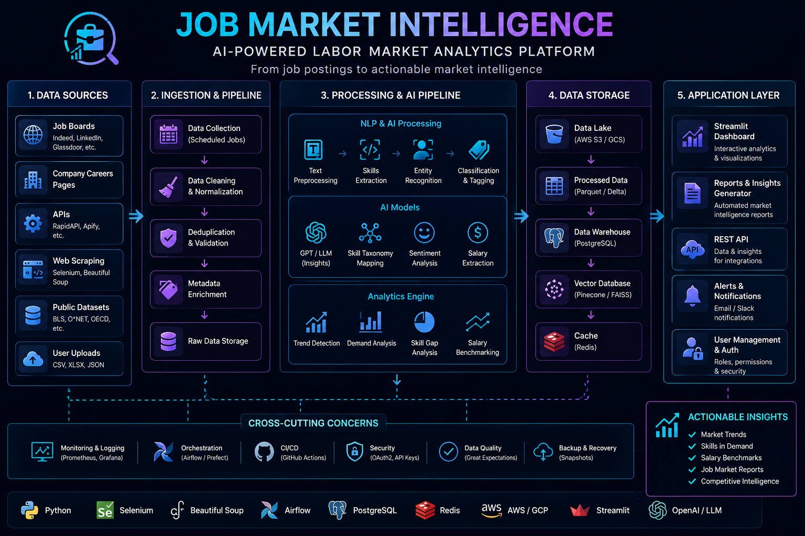

<p align="center">
  
</p>

<h1 align="center">Labor Market Intelligence Platform</h1>

<p align="center">
  <strong>MVP analytics and job data platform for public ATS ingestion, historical tracking, dashboards, and API access.</strong>
</p>

<p align="center">
  
  
  
  
  
  
  
</p>

<p align="center">
  <strong>Public ATS APIs</strong> • <strong>Historical Tracking</strong> • <strong>Normalization</strong> • <strong>AI Hooks</strong>
</p>

<p align="center">
  A portfolio-grade backend and data project using safer public sources instead of brittle, high-risk scraping.
</p>

<p align="center">
  <a href="#quick-start">Quick Start</a> •
  <a href="#architecture">Architecture</a> •
  <a href="#tech-stack">Tech Stack</a> •
  <a href="#roadmap">Roadmap</a>
</p>

<hr/>

<table>
  <tr>
    <td width="25%" align="center">
      <strong>Source Strategy</strong><br/>
      Public ATS APIs
    </td>
    <td width="25%" align="center">
      <strong>Storage Model</strong><br/>
      Canonical + Historical
    </td>
    <td width="25%" align="center">
      <strong>Primary Goal</strong><br/>
      Analytics-ready jobs data
    </td>
    <td width="25%" align="center">
      <strong>Future Layer</strong><br/>
      Search + AI enrichment
    </td>
  </tr>
</table>

<hr/>

## EN | About

This repository is an MVP analytics and job data platform for **labor market intelligence**.

It is designed to ingest, normalize, preserve, and serve job-market data in a way that is:

- safer from a compliance perspective
- easier to scale technically
- ready for analytics
- ready for future search and enrichment layers
- strong as a realistic portfolio engineering project

Instead of starting with aggressive scraping from fragile platforms, this project begins with:

- public ATS APIs
- public company careers pages
- open datasets
- structured normalization
- append-only historical storage

> The core idea is simple: build clean, reproducible pipelines first, then layer search, analytics, and enrichment on top.

## ES | Sobre el proyecto

Este repositorio es un MVP de analitica y datos de empleo para una **plataforma de inteligencia del mercado laboral**.

Esta pensado para ingestar, normalizar, conservar y exponer datos de empleo de una forma:

- mas segura desde lo legal
- mas escalable tecnicamente
- lista para analitica
- preparada para futuras capas de busqueda y enriquecimiento
- fuerte como proyecto realista de portfolio

En lugar de arrancar con scraping agresivo sobre plataformas fragiles, el proyecto empieza con:

- APIs publicas de ATS
- paginas publicas de careers
- datasets abiertos
- normalizacion estructurada
- almacenamiento historico append-only

> La idea central es clara: construir primero datos y pipelines reproducibles, y despues sumar busqueda, analitica y enriquecimiento arriba.

<hr/>

## Highlights

<table>
  <tr>
    <td width="33%">
      <h3>Safer by design</h3>
      <p>Starts from public ATS APIs and durable public sources instead of brittle scraping workflows.</p>
    </td>
    <td width="33%">
      <h3>History from day one</h3>
      <p>Stores canonical records and append-only snapshots so trend analysis is possible later.</p>
    </td>
    <td width="33%">
      <h3>AI-ready foundation</h3>
      <p>Structured data prepared for enrichment, embeddings, semantic search, and reporting.</p>
    </td>
  </tr>
</table>

<table>
  <tr>
    <td width="50%">
      <h3>Implemented now</h3>
      <ul>
        <li>FastAPI backend</li>
        <li>PostgreSQL persistence</li>
        <li>Alembic migrations</li>
        <li>Prefect ingestion flow</li>
        <li>Greenhouse connector</li>
        <li>Normalization and enrichment layer</li>
        <li>Historical snapshots and inactive-job detection</li>
        <li>Filtering and stats endpoints</li>
        <li>Dashboard layer served from FastAPI</li>
        <li>Repository and API tests</li>
      </ul>
    </td>
    <td width="50%">
      <h3>Next layers</h3>
      <ul>
        <li>Lever and Ashby connectors</li>
        <li>Advanced salary normalization</li>
        <li>Expanded skill taxonomy and enrichment</li>
        <li>Trend analysis and dashboards</li>
        <li>Embeddings and semantic search</li>
        <li>Analytics marts and warehouse layer</li>
      </ul>
    </td>
  </tr>
</table>

<hr/>

## Why this approach

<table>
  <tr>
    <th align="left">Brittle path</th>
    <th align="left">This project's path</th>
  </tr>
  <tr>
    <td>Aggressive scraping first</td>
    <td>Public APIs and durable public sources first</td>
  </tr>
  <tr>
    <td>Low traceability</td>
    <td>Raw payload preservation and snapshots</td>
  </tr>
  <tr>
    <td>Fast prototype, weak foundation</td>
    <td>Serious MVP, stronger production path</td>
  </tr>
  <tr>
    <td>Harder compliance posture</td>
    <td>Cleaner legal-first strategy</td>
  </tr>
  <tr>
    <td>Rebuild later for analytics</td>
    <td>Analytics-ready from the start</td>
  </tr>
</table>

<hr/>

## Architecture

<p align="center">
  
</p>

```text
                 +-----------------+
                 | Job Sources     |
                 |-----------------|
                 | Greenhouse API  |
                 | Lever API       |
                 | Ashby           |
                 | Company sites   |
                 | Public datasets |
                 +--------+--------+
                          |
                    Ingestion Layer
                          |
             +------------+------------+
             |                         |
       Raw JSON Storage          Metadata Queue
             |                         |
             +------------+------------+
                          |
                    Normalization
                          |
                    NLP Enrichment
                          |
                 Deduplication Layer
                          |
                      Warehouse
                          |
          +---------------+---------------+
          |                               |
      Analytics API                  Search API
          |                               |
      Dashboards                   Semantic Search
```

<details>
<summary><strong>MVP slice implemented today</strong></summary>

- ingestion
- normalization
- baseline enrichment
- historical persistence
- API exposure
- inactive posting detection
- snapshot deduplication
- dashboard layer

</details>

<hr/>

## Tech Stack

| Layer | Technology | Purpose |
| --- | --- | --- |
| API | FastAPI | Serve job records and analytics-ready endpoints |
| Orchestration | Prefect | Run ingestion and enrichment flows |
| Database | PostgreSQL | Store canonical jobs and historical snapshots |
| Local Infra | Docker Compose | Portable local environment |
| ORM | SQLAlchemy | Data models and persistence |
| Migrations | Alembic | Version database schema changes |
| NLP | Keyword heuristics | Lightweight skill extraction and text enrichment |
| Future Search | pgvector | Embeddings and semantic retrieval |
| Future Analytics | dbt + ClickHouse | Dimensional models and heavy analytics |

<hr/>

## Repository Structure

```text
.
|-- api/
|   |-- app/
|   |   |-- api/
|   |   |-- contracts/
|   |   |-- core/
|   |   |-- db/
|   |   |-- models/
|   |   |-- repositories/
|   |   |-- schemas/
|   |   `-- services/
|   |-- Dockerfile
|   `-- requirements.txt
|-- docs/
|   `-- images/
|       |-- architecture/
|       |-- branding/
|       `-- screenshots/
|-- migrations/
|   `-- versions/
|-- pipelines/
|   |-- connectors/
|   |-- flows/
|   |-- normalizers/
|   |-- Dockerfile
|   `-- requirements.txt
|-- sql/
|   `-- init.sql
|-- tests/
|   |-- test_api_jobs.py
|   |-- test_normalizers.py
|   `-- test_repository_jobs.py
|-- docker-compose.yml
|-- CONTRIBUTING.md
|-- CODE_OF_CONDUCT.md
|-- LICENSE
|-- SECURITY.md
`-- .env.example
```

<hr/>

## Data Model

<table>
  <tr>
    <td width="50%">
      <h3><code>job_postings</code></h3>
      <p>Canonical current-state table for the latest known version of each posting.</p>
      <ul>
        <li>Powers the API</li>
        <li>Represents active records</li>
        <li>Keeps normalized fields</li>
        <li>Stores extracted skills</li>
        <li>Tracks first and last seen timestamps</li>
      </ul>
    </td>
    <td width="50%">
      <h3><code>job_snapshots</code></h3>
      <p>Append-only historical observations stored over time.</p>
      <ul>
        <li>Enables trend analysis</li>
        <li>Supports auditability</li>
        <li>Allows historical comparisons</li>
        <li>Preserves raw and normalized payloads</li>
      </ul>
    </td>
  </tr>
</table>

<hr/>

## Use cases

This repository can grow into:

- a recruiting intelligence SaaS
- a labor market analytics dashboard
- a salary insights engine
- a structured jobs API
- an AI-ready recruiting data layer
- a semantic search backend for job discovery

<hr/>

## Legal-first strategy

### Preferred sources

- Greenhouse Job Board API
- Lever Postings API
- Ashby public endpoints when available
- public careers pages
- open labor datasets
- internal enrichment on top of legally collected data

### Not the initial priority

- aggressive LinkedIn scraping
- aggressive Indeed scraping
- high-maintenance anti-bot flows

### Why this matters

- lower operational friction
- lower maintenance cost
- better production durability
- stronger long-term platform design

<hr/>

## Quick Start

### 1. Clone the repository

```bash
git clone https://github.com/bentancourtfiorellanahir-bot/job-market-intelligence.git
cd job-market-intelligence
```

### 2. Create the environment file

```bash
cp .env.example .env
```

Windows PowerShell:

```powershell
Copy-Item .env.example .env
```

### 3. Set a valid Greenhouse board token

The Greenhouse connector requires a real public board token. For a quick local test, the default example uses:

```env
GREENHOUSE_BOARD_TOKEN=greenhouse
```

### 4. Start the stack

```bash
docker compose up --build
```

### 5. Run database migrations

```bash
docker compose run --rm api alembic upgrade head
```

### 6. Run the ingestion flow

```bash
docker compose run --rm pipelines python -m flows.ingest_greenhouse
```

### 7. Explore the API

- `http://localhost:8000/dashboard`
- `http://localhost:8000/health`
- `http://localhost:8000/docs`
- `GET /v1/jobs`
- `GET /v1/jobs?q=python`
- `GET /v1/jobs?remote_type=remote&seniority=senior`
- `GET /v1/jobs?before_last_seen_at=2026-05-11T12:00:00Z`
- `GET /v1/jobs/stats`

### 8. Run basic checks

```bash
python -m unittest discover -s tests -p "test_*.py"
```

<hr/>

## Repository health

The repository now includes:

- CI workflow for lint, compile, and test checks
- Alembic migration scaffold
- issue templates
- contribution guide
- security policy
- code of conduct
- MIT license
- editor configuration
- tests for normalization, repository behavior, and API routes

<hr/>

## Roadmap

### Current phase status

- Phase 1 is complete as a serious MVP foundation.
- Phase 2 already has baseline intelligence features implemented.
- Phase 3 is still pending.

### Phase 1 | Serious MVP

- [x] ingest jobs
- [x] normalize records
- [x] store historical snapshots
- [x] deduplicate unchanged snapshots
- [x] mark missing jobs inactive
- [x] expose a simple API
- [x] add dashboard layer

### Phase 2 | Intelligence

- [x] baseline skill extraction
- [x] baseline salary parsing and normalization
- [x] remote classification
- [x] seniority detection
- [ ] richer skill taxonomy and ontology mapping
- [ ] stronger salary normalization across formats and currencies
- [ ] confidence-scored enrichment
- [ ] trend analysis

### Phase 3 | AI Layer

- [ ] embeddings
- [ ] semantic search
- [ ] market report generation
- [ ] hiring trend prediction

<hr/>

## Project direction

<table>
  <tr>
    <td width="50%">
      <h3>What it is today</h3>
      <ul>
        <li>A clean MVP</li>
        <li>A structured ingestion platform</li>
        <li>An analytics-ready backend</li>
        <li>A working dashboard</li>
        <li>A strong portfolio project</li>
      </ul>
    </td>
    <td width="50%">
      <h3>What it can become</h3>
      <ul>
        <li>A productized market-intelligence platform</li>
        <li>A search and insights API</li>
        <li>A recruiting analytics engine</li>
        <li>An AI-assisted labor market system</li>
      </ul>
    </td>
  </tr>
</table>

<hr/>

## Status

This is an **active MVP foundation** with a clear direction:

- practical
- extensible
- analytics-ready
- portfolio-strong
- aligned with real-world data engineering work
